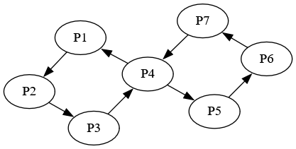
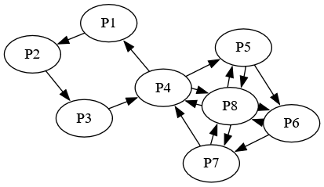

# Advanced Options

So you want some more control beyond what the standard options offer? This is the right place.

To start, all worlds in the medium are indexed in a cyclical way. This means that if a connection would go past the amount of slots in the Medium, or before the start, it loops around instead(think of a clock face with an amount of hours equal to the number of slots in the Medium).

## Medium Topology

The option `medium_topo` offers more than just Ring, Dual and SBURB. Each of these are actually defined as a set of cyclical offsets that define which slots items can get sent to.

Ring, for example, is `0,1`, meaning that it'll be able to send items to both itself(0), and the next world in the cycle(1). SBURB is defined as just `1` to remove the ability for a world to find its own items. Dual, then, is defined as `-1,0,1`, allowing for items to be sent forwards and backwards along the ring.

You can put any whole numbers in this definition, though. For example, `-2,0,1` will allow all worlds to send items to the slot two behind them in the cycle, themselves and the world in front of them.

## Modifying the Medium

The hidden option `medium_slots`(only visible in Options Creator under Advanced Options), allows you to directly specify the slots and order of the Medium. It has a few special values:

- **ALL**(default) - all slots except for SBURBelago ones
- **BETWEEN** - all slots between this and the previous SBURBelago slot in slot order
- **UNTIL** - all slots before this slot

Slots specified to be Skaia will be removed from this list before it's used.

Combined with `medium_topo`, this is an incredibly powerful tool. Even more so when combined with the ability to have multiple SBURBelago slots. The `BETWEEN` and `UNTIL` options don't even really make sense without them, since there is a restriction in place that all slots need to be managed by at least one SBURBelago slot. The item rules this set up quickly run into issues if not all worlds are part of the rule setting.

`medium_slots` is a list, so you can enter the same slot in there multiple times if you want even more control. This can allow for some more resulting topologies that were previously completely impossible.

### Multiple SBURBelago slots

When multiple slots are involved, the rules change slightly. Each slot will add connections to all the worlds it manages, and if multiple slots touch the same world, the connections they add will be combined additively.

One added restriction is that a world can't have connections in both a progression_only sburb session and a normal one.

Skaia worlds get connections added to and from each of their slot's Medium worlds.

As an example, let's take a world with 7 slots, named P1-7. Then the following two SBURBelago worlds will result in the topology shown below:

```yaml
name: SBURB
game: SBURBelago
SBURBelago:
  medium_topo: SBURB
  progression_only: false
  medium_slots:
    - P1
    - P2
    - P3
    - P4
---
name: SBURB2
game: SBURBelago
SBURBelago:
  medium_topo: SBURB
  progression_only: false
  medium_slots:
    - P4
    - P5
    - P6
    - P7
```



If we add an 8th world as Skaia to the second slot, we'll get the following instead:



## Using slot numbers instead of player names

In cases where the player name is decided by a random option roll, you can use the slot number instead of the player name anywhere slots get specified(so in both the `medium_slots` and `skaia` options). The above yaml could also have been written as the following, also showing the ability to mix and match slot numbers and player names:

```yaml
name: SBURB
game: SBURBelago
SBURBelago:
  medium_topo: SBURB
  progression_only: false
  medium_slots:
    - 1
    - 2
    - 3
    - 4
---
name: SBURB2
game: SBURBelago
SBURBelago:
  medium_topo: SBURB
  progression_only: false
  medium_slots:
    - 4
    - P5
    - P6
    - 7
```

## Hiding SBURBelago from the multiworld

If you have a single SBURBelago slot, and there's no item links in the multi, you can have it remove itself from the multiworld by setting the hidden option `remove_self` to `true`. This also requires it to be the last slot, which you can accomplish by naming its yaml file to be the last in alphabetical case-insensitive order.
