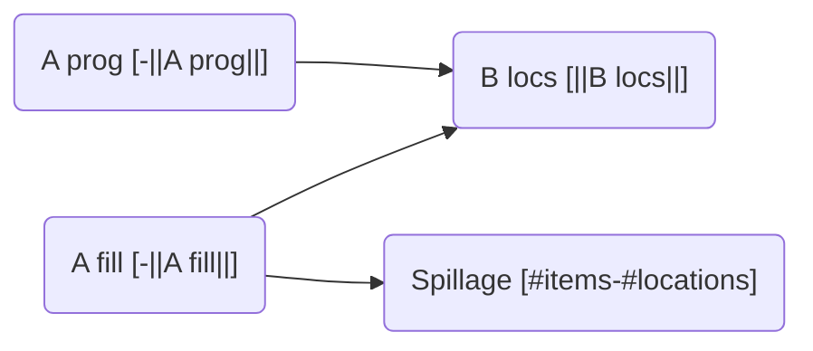
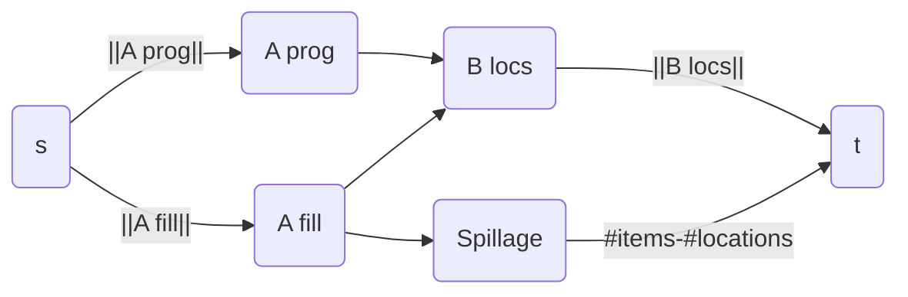
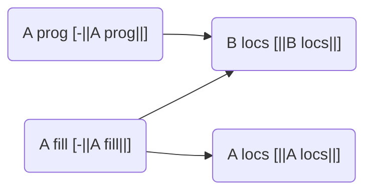
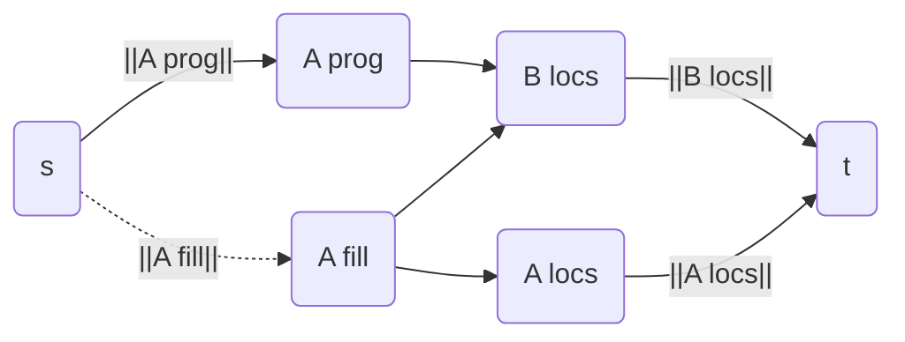
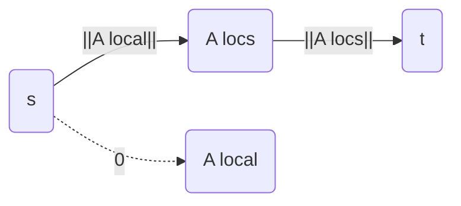

# Flow graph notes

Items represented as (name,player,flags).

items grouped in Counter-type sets(item, count) and locations in `set[Location]` as nodes of the graph.

Required fast operations:

- lookup item tuple(name,player,flags) => vertex
- lookup location => vertex
- update path between item+location for both placement and removal of item at location

## Basic encoding strategy

- item nodes are sources with outgoing demand equal to the count sum
  - Split progression items off from the rest
  - progression items have outgoing demand that needs to be satisfied
  - other items have outgoing demand as well, but have an extra edge to a spillage node
- location nodes have incoming demand equal to the size of the node's location set
- spillage node with a incoming demand equal to the difference in item vs location count if there is such a discrepancy.

Run flow feasibility using the typical demand encoding.

## Example requirement encodings

Each of these is additive, there is no removing of existing edges.

### World chaining

Resulting flow graph:

### World chaining with progression only

non-progression items have edges added to all locations in the current sburb set.

Resulting flow graph:

### Local items

Split out the items specified into a new vertex, add edge with corresponding demand and capacity, connect to world's locations.

Resulting flow graph:

This ends up effectively removing the `A local` node from the graph entirely, replacing it with a demand edge of the same size from `s` to `A locs`. Special care will have to be taken to keep this relationship intact across the representations.
