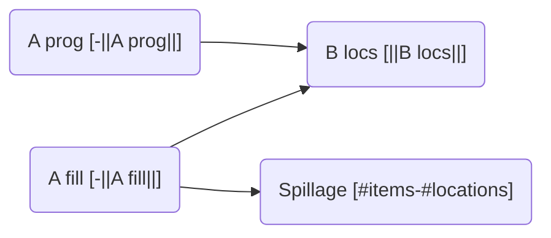
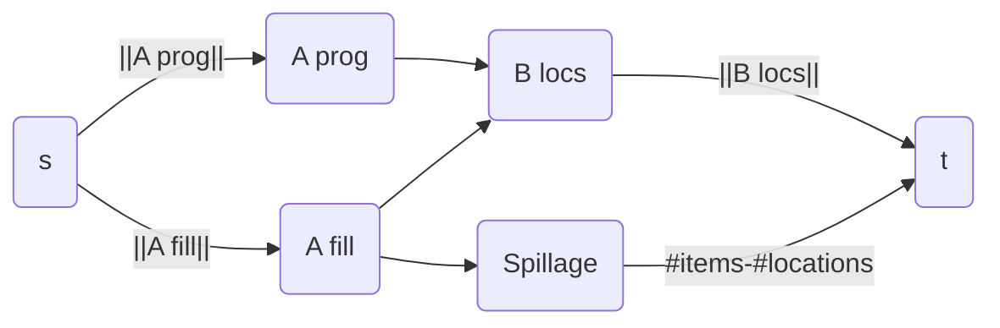
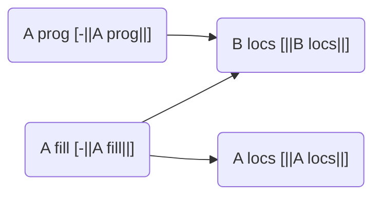
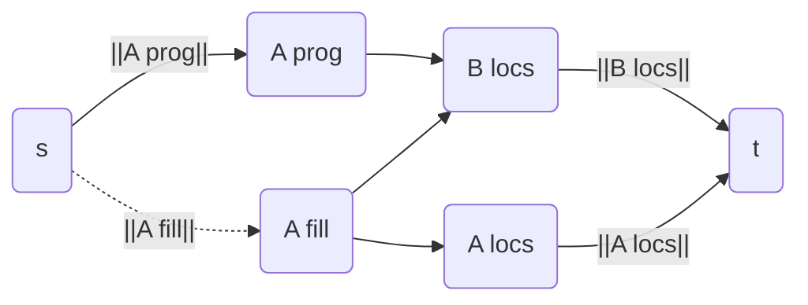

# Flow graph notes

Items represented as (name,player,flags).

items grouped in Counter-type sets(item, count) and locations in `set[Location]` as nodes of the graph.

Required fast operations:

- lookup item tuple(name,player,flags) => vertex
- lookup location => vertex
- update path between item+location for both placement and removal of item at location

## Basic encoding strategy

- item nodes are sources with outgoing demand equal to the count sum
  - Split progression items off from the rest
  - progression items have outgoing demand that needs to be satisfied
  - other items have outgoing demand as well, but have an extra edge to a spillage node
- location nodes have incoming demand equal to the size of the node's location set
- spillage node with a incoming demand equal to the difference in item vs location count if there is such a discrepancy.

Run flow feasibility using the typical demand encoding.

## Example allowed flow encodings

Each of these is additive, there is no removing of existing edges.

### World chaining

Resulting flow graph:

### World chaining with progression only

non-progression items have edges added to all locations in the current sburb set.

Resulting flow graph:

## Filters

To handle global restrictions, the concept of filters is needed. When a flow like the above is added, it's in the form of (item sets) => (location sets). These filters will split a flow like this into multiple as needed, disallowing edges that shouldn't exist according to them.

### (non-)Local items

Split off sets for specified items, then split location sets as necessary for those items' allowed flows.

### Priority locations

There's two cases here:

1. More progression items than priority locations:
   - Remove edges from non-progression items to the priority locations
2. More priority locations than progression items
   - Remove edges to non-priority locations from progression items

### Excluded locations

Remove edges from progression and/or useful items to excluded locations.

### (non-)Early Items

Split off set of items requested with their amounts, then if such a set is involved in a flow, split off to relevant locations.
